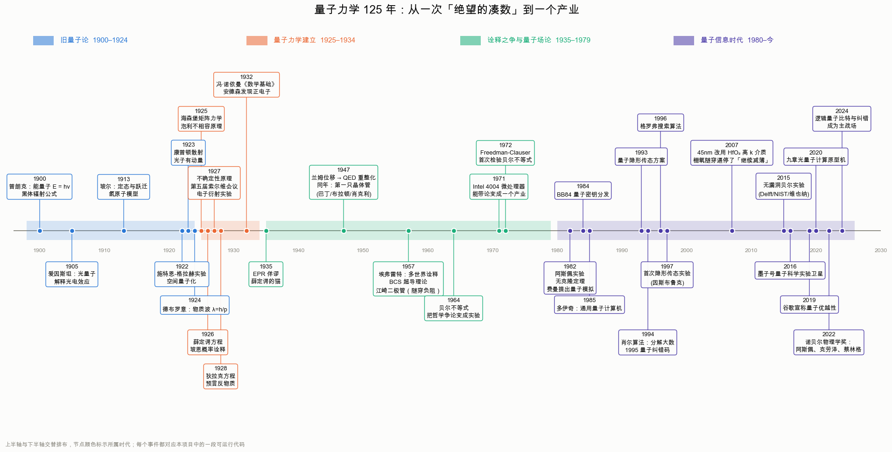
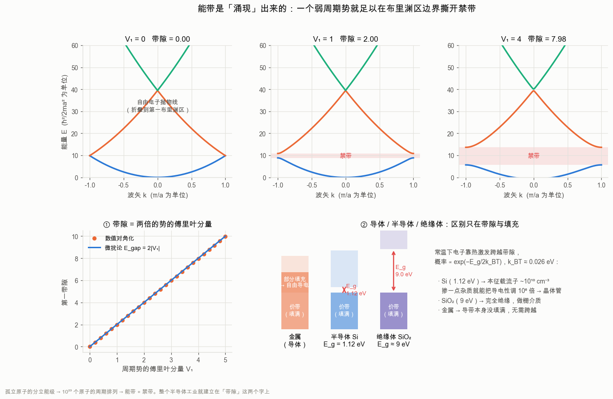
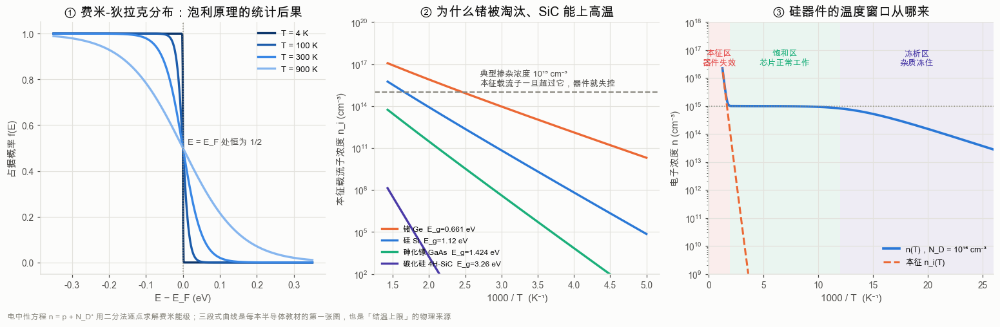
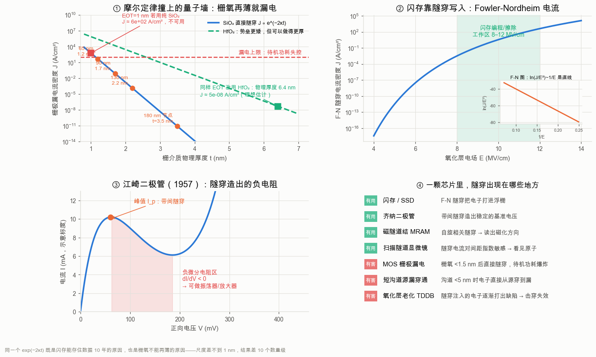
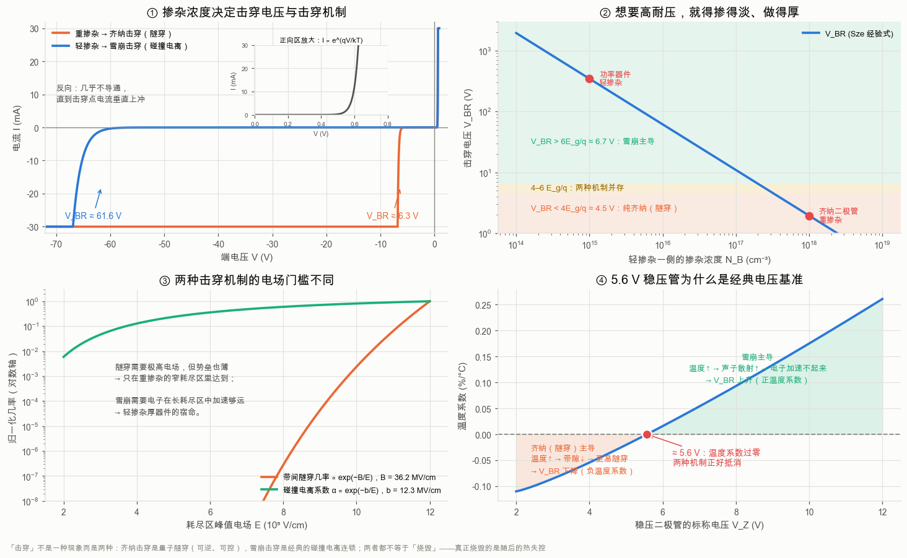
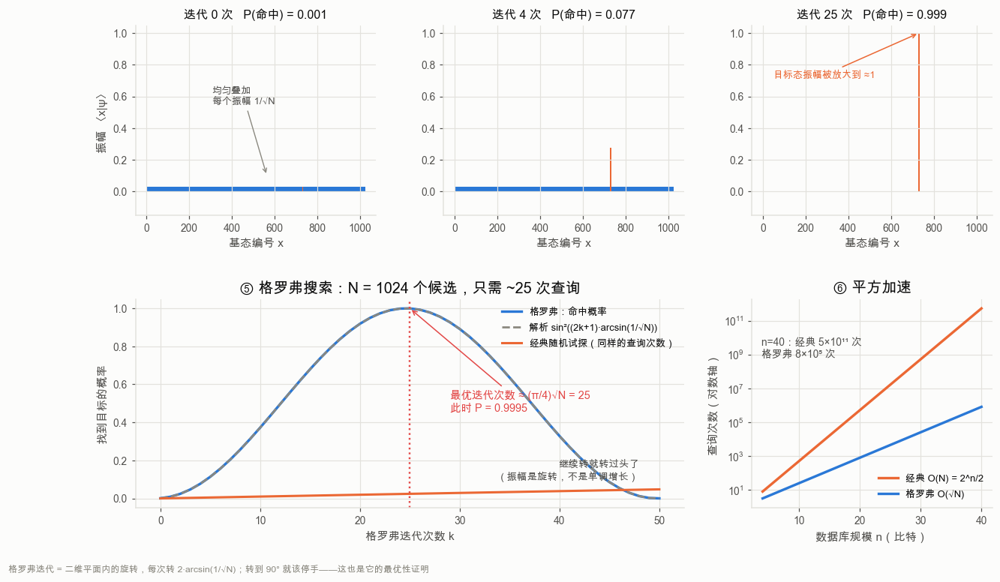
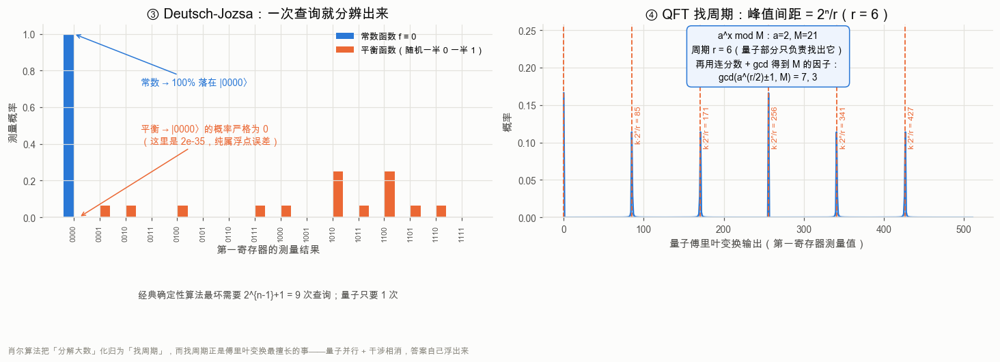
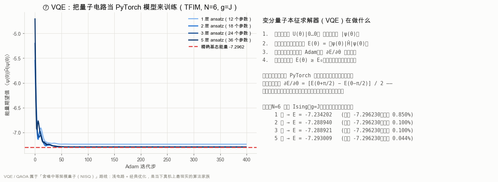
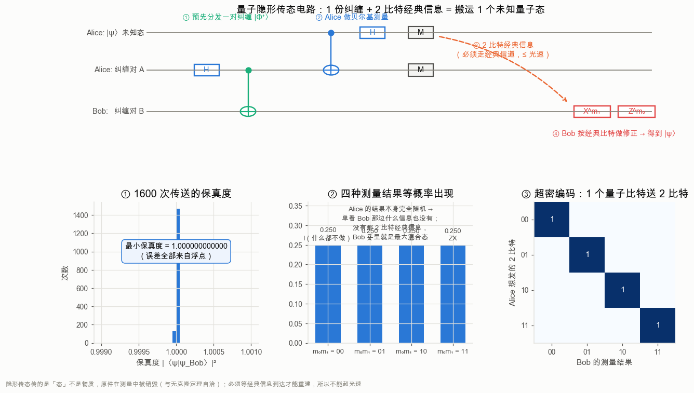

# 量子力学发展史 · 可视化与数值重现

用 **PyTorch + NumPy/SciPy + Matplotlib** 把量子力学 125 年的关键节点重跑一遍：
**每一条公式都对应一段可运行的代码，每一张图都是真算出来的**，没有一张是示意图。

* 普朗克常数 $h$ 是用梯度下降从合成光谱里反演出来的（误差 0.04%）
* 贝尔不等式的 $2\sqrt2$ 是抽样抽出来的（超出经典上界 184σ）
* $21 = 3\times7$ 是量子傅里叶变换找周期找出来的
* 栅氧化层的隧穿漏电曲线，用的是和第 3 章隧穿完全相同的那一个指数

```bash
pip install -r requirements.txt
python run_all.py           # 约 100 秒，输出 31 张图到 figures/
python run_all.py 6 8       # 只跑第 6 章（纠缠）和第 8 章（芯片）
python -m qhv.s05_dirac     # 单独跑某一章，终端会先打印这一章的故事
```

---

## 目录

| 章节 | 主题 | 核心人物 / 年份 | 代码 |
|---|---|---|---|
| 1 | 能量子与黑体辐射 | 普朗克 1900 | `qhv/s01_planck.py` |
| 2 | 光电效应 · 玻尔原子 · 物质波 | 爱因斯坦 1905 / 玻尔 1913 / 德布罗意 1924 | `qhv/s02_einstein_bohr.py` |
| 3 | 薛定谔方程与玻恩诠释 | 薛定谔、玻恩 1926 | `qhv/s03_schrodinger.py` |
| 4 | 矩阵力学与不确定性原理 | 海森堡 1925–27 | `qhv/s04_heisenberg.py` |
| 5 | 相对论性量子力学与反物质 | 狄拉克 1928 | `qhv/s05_dirac.py` |
| 6 | 量子纠缠与贝尔不等式 | EPR 1935 / 贝尔 1964 / 阿斯佩 1982 | `qhv/s06_entanglement.py` |
| 7 | 量子涌现：相变与经典世界 | 安德森 1972 / 楚雷克 1981 | `qhv/s07_emergence.py` |
| **8** | **芯片里的量子力学：能带 / 隧穿 / 击穿** | **肖克利 1947 / 江崎 1957** | `qhv/s08_chips.py` |
| 9 | 量子计算 | 费曼 1982 / 肖尔 1994 / 格罗弗 1996 | `qhv/s09_computing.py` |
| 10 | 量子通信 | BB84 1984 / 隐形传态 1993 | `qhv/s10_communication.py` |
| 11 | 时间轴与人物谱系 | — | `qhv/s11_timeline.py` |




> 注意上图里的年龄：海森堡提出矩阵力学时 24 岁，狄拉克写下狄拉克方程时 26 岁，
> 泡利提出不相容原理时 25 岁。当时人们把量子力学叫作 **Knabenphysik（男孩物理学）**。

---

# 第一部分：发展史

## 一、旧量子论（1900–1924）：被逼出来的假设

### 普朗克与「绝望的行为」

**一句话**：为了让公式对上实验，普朗克被迫假设能量是一份一份的。

19 世纪末的物理学看上去已经完工了。开尔文说天边只剩「两朵乌云」，
其中一朵就是**黑体辐射**——一个理想吸收体加热后到底该发出什么颜色的光。
基于能量均分定理的**瑞利-金斯定律**

$$B_\lambda(\lambda,T)=\frac{2ckT}{\lambda^4}$$

在长波端对得很好，在短波端却发散到无穷——后人称之为**紫外灾变**。
这不是小数点后的分歧，而是经典物理在这里给出了「一个火炉会瞬间放出无穷能量」的荒谬预言。

1900 年 12 月 14 日，普朗克报告：如果假设腔壁振子的能量只能取分立值 $E=nh\nu$，就能得到

$$B_\lambda(\lambda,T)=\frac{2hc^2}{\lambda^5}\cdot\frac{1}{e^{hc/\lambda k_BT}-1}$$

它在全波段与实验精确吻合。普朗克自己称这是「一次绝望的行为」（an act of despair），
此后十几年一直想把 $h$ 消掉，没成功。**量子力学的生日就是这一天。**

**本项目做了什么**：把普朗克公式当成一个 PyTorch 可微模型，用带 3% 噪声的合成光谱，
对 $\log h$、$\log k_B$ 做 Adam 优化。从偏离真值 60% / 150% 的初值出发，收敛到

* $h = 6.6237\times10^{-34}\ \mathrm{J\cdot s}$（真值 $6.62607\times10^{-34}$，误差 **0.04%**）
* $k_B = 1.3795\times10^{-23}\ \mathrm{J/K}$（真值 $1.380649\times10^{-23}$，误差 **0.08%**）

这正是普朗克 1900 年干的事：他由黑体谱第一次给出了 $h$ 和玻尔兹曼常数，
精度在当时超过了所有其他方法。


关键物理在下面这张图里：经典理论给每个振动模式都分配 $k_BT$（模式有无穷多个 → 能量无穷），
而量子假设让 $h\nu \gg k_BT$ 的高频模式**根本激发不起来**——它们被「冻结」了。
同一个机制也解释了为什么低温下固体的比热会掉下去（爱因斯坦 1907、德拜 1912）。


> **生活里的黑体辐射**：白炽灯泡只有约 5% 的能量变成可见光，其余都在红外——
> 因为钨丝 2800 K 的普朗克谱峰值在 1 µm 附近。太阳表面 5800 K，峰值恰好落在
> 550 nm 的黄绿光，而人眼最灵敏的波长也正是 550 nm。这不是巧合。

### 爱因斯坦：光真的是粒子

**一句话**：普朗克以为自己只是玩了个数学技巧，爱因斯坦说不，光本身就是颗粒。

1905 年「奇迹年」，26 岁的爱因斯坦一口气发了狭义相对论、布朗运动和光电效应三篇论文。
第三篇最激进：光由一份份的**光量子**组成，每份能量 $h\nu$。打到金属上时，
一个光子把全部能量交给一个电子：

$$E_{\rm kin,max}=h\nu-W \quad\Longrightarrow\quad U_s=\frac{h}{e}\nu-\frac{W}{e}$$

这个预言极强，而且和经典波动图像正面冲突：

| | 经典波动理论预言 | 实验事实 |
|---|---|---|
| 电子动能 | 随光强增大 | **只随频率变**，与光强无关 |
| 截止频率 | 不存在，光够强总能打出电子 | **存在**，低于 $\nu_0$ 再强也打不出 |
| 时间延迟 | 弱光要累积几秒到几分钟 | **立即**（<10⁻⁹ s） |
| 直线斜率 | — | 三种金属**严格平行**，斜率恒为 $h/e$ |

密立根本来想证伪它，实验做了十年，1916 年反而用它把 $h$ 测到了 0.5% 的精度。
爱因斯坦 1921 年的诺贝尔奖正是因为这篇论文——**不是**因为相对论。

本项目对三种金属（Na / Zn / Pt）的模拟数据做「共享斜率」的多组线性回归，
得到 $h=6.644\times10^{-34}$（误差 0.27%）。


> **今天的光电效应**：手机摄像头的 CMOS 传感器、太阳能电池、光电倍增管、
> 自动门的红外感应，全部是光电效应的直接应用。你每拍一张照片，
> 就是几亿个光子按 $E=h\nu$ 的规矩把电子打进势阱里。

### 玻尔与德布罗意：拼图的两块

玻尔 1913 年假设电子只能待在角动量量子化的定态上，跃迁时才发光：

$$E_n=-\frac{13.606\ \mathrm{eV}}{n^2},\qquad h\nu=E_{n_i}-E_{n_f}$$

一举算出了 1885 年巴尔末凭经验凑出的公式。代码算出的巴尔末线：
**656.1 nm**（Hα 红）、**486.0 nm**（Hβ 青）、**433.9 nm**、**410.1 nm**——与实验值逐条吻合。
你在天文照片里看到的猎户座大星云那片红，就是 656.1 nm 的 Hα。


玻尔模型有个致命弱点：那个量子化条件 $L=n\hbar$ 是硬塞进去的，没有理由。
1924 年德布罗意在博士论文里给出了理由：既然光波是粒子，物质粒子会不会也是波？
$\lambda=h/p$ 代入 $2\pi r=n\lambda$，玻尔的条件立刻变成一句大白话——
**轨道上必须容得下整数个波长，否则波自己把自己抵消掉**。

答辩委员会看不懂，去问爱因斯坦，爱因斯坦回信说「他掀起了一块巨大帷幕的一角」。
三年后戴维孙-革末的电子衍射实验证实了物质波。今天的电子显微镜之所以能看到
比光学显微镜细一万倍的结构，就是因为 100 keV 电子的德布罗意波长只有 3.7 pm。


---

## 二、量子力学的建立（1925–1932）：两条路通向同一座山

### 海森堡：不要谈论看不见的东西

1925 年夏天，24 岁的海森堡因花粉症躲到北海的赫尔戈兰岛，决定只谈**可观测量**
（谱线的频率与强度），不谈谁也没见过的「电子轨道」。结果算出来的东西不满足乘法交换律。
玻恩认出那是矩阵乘法，与约当一起写下了整个理论最核心的一行：

$$[\hat x,\hat p]=\hat x\hat p-\hat p\hat x=i\hbar$$

两年后，海森堡从中得到了**不确定性原理**：

$$\sigma_x\sigma_p\ge\frac{\hbar}{2},\qquad
\text{一般地}\quad \sigma_A\sigma_B\ge\tfrac12\left|\langle[\hat A,\hat B]\rangle\right|$$

必须强调一件事：**这不是「测不准」，而是「本来就没有同时确定的值」。**
$x$ 与 $p$ 的本征基互为傅里叶变换，一个窄，另一个必然宽——这是数学恒等式，
跟仪器好坏没有关系。（海森堡最初用「显微镜思想实验」讲扰动，这个讲法流传最广，
但严格来说它讲的是另一件事：测量扰动与内禀不确定性是两个独立的命题。）

代码用产生/湮灭算符直接把 $\hat x,\hat p,\hat H$ 造成矩阵，验证了：

* $[\hat x,\hat p]$ 的对角元 $=1.000i$（即 $i\hbar$，自然单位下 $\hbar=1$）
* $\hat H=a^\dagger a+\frac12$ 的本征值 $=0.5,1.5,2.5,\dots$ 即 $(n+\frac12)\hbar\omega$
* Fock 态 $\sigma_x\sigma_p=(n+\frac12)\hbar$；高斯波包恒为 $0.5000\pm2\times10^{-9}$（最小不确定态）
* 自由波包必然扩散：$\sigma_x(t)=\sigma_0\sqrt{1+(\hbar t/2m\sigma_0^2)^2}$，数值与解析重合


> **不确定性原理的实际后果**：白矮星和中子星靠「简并压」抗住引力坍缩——
> 电子被挤到很小的空间里（$\sigma_x$ 小），动量弥散就必须很大（$\sigma_p$ 大），
> 于是产生一个与温度无关的压强。原子之所以不塌缩、你之所以不会陷进椅子里，
> 也是同一件事。

### 薛定谔与玻恩：波函数和它的含义

1926 年初，薛定谔在阿罗萨度假时写下了另一条路：

$$i\hbar\frac{\partial\psi}{\partial t}=\hat H\psi,\qquad
\hat H=-\frac{\hbar^2}{2m}\nabla^2+V(\mathbf r)$$

同年他证明波动力学与矩阵力学完全等价。但 $\psi$ 到底是什么？薛定谔以为是电荷密度，
玻恩几个月后给出了正确答案，也是那颗哲学炸弹：$|\psi(x)|^2$ 是**概率密度**。

薛定谔一辈子拒绝接受这个解释（「我不喜欢它，我后悔跟它有过关系」），
爱因斯坦也不接受（「上帝不掷骰子」）。但玻恩规则才是量子力学的地基，
玻恩为此拿到了 1954 年的诺贝尔奖——比这个想法晚了 28 年。

代码把 $\hat H$ 离散成矩阵后，「解薛定谔方程」就是一次 `torch.linalg.eigh`：
谐振子前 6 个能级与 $(n+\frac12)\hbar\omega$ 的最大误差是 $2.5\times10^{-4}$。
**能级的量子化不是额外假设，它是「波函数必须满足边界条件」的自动结果**——
和吉他弦只能发出基频与泛音是同一个数学。


**量子隧穿**用 split-step 傅里叶法（`torch.fft`，复数张量）演化：
能量 $E<V_0$ 的波包依然有一部分穿过势垒，数值透射率与解析公式在 $0.2\le E\le4$ 全程逐点吻合：

$$T\approx e^{-2\kappa a},\qquad \kappa=\frac{\sqrt{2m(V_0-E)}}{\hbar}$$

这条指数律是本项目里出现次数最多的公式：它是 α 衰变的寿命公式，
是太阳里氢聚变能在 1500 万度（远低于经典所需温度）就点着的原因，
是扫描隧道显微镜能看见单个原子的原因，也是**第 8 章里闪存能存数据、
而栅氧化层不能再薄**的同一个原因。


**玻恩规则最直观的样子**是双缝实验：单个电子在屏上留下一个随机的点，
几万个电子累积出干涉条纹。关键在于**先叠加振幅、再取模方**（$|\psi_1+\psi_2|^2$），
而不是先取模方再相加（$|\psi_1|^2+|\psi_2|^2$）。这一步之差，就是量子与经典的全部分界。

费曼说双缝「包含了量子力学的唯一奥秘」。而且这里有个常被误传的点：
**电子不是「同时穿过两条缝」，也不是「穿过其中一条」——「它穿过哪条缝」这个问题
在没有测量装置的情况下根本没有定义。** 一旦你加上探测器去看它走哪条缝，条纹立刻消失。


### 狄拉克：我的方程比我聪明

1928 年狄拉克要一个对时间和空间都是一阶、满足洛伦兹协变的方程：

$$(i\hbar\gamma^\mu\partial_\mu-mc)\psi=0,\qquad
\{\gamma^\mu,\gamma^\nu\}=2\eta^{\mu\nu}I_4$$

代价是 $\psi$ 必须是四分量旋量、系数必须是矩阵。它一次性白送了三样东西：
**电子自旋 $\tfrac12$ 与 $g=2$**（不用手工塞）、**氢原子精细结构**、以及**负能解**。

负能解起初被当成灾难。狄拉克 1931 年断言那是「反电子」，
1932 年安德森就在宇宙线云室里找到了正电子。狄拉克后来说：「我的方程比我聪明。」


代码严格演化了 1+1 维狄拉克方程（动量空间里 $U(k,t)=\cos Et\,I-i\frac{\sin Et}{E}H(k)$）。
正能解与负能解的干涉让 $\langle x\rangle$ 抖动——这就是 **Zitterbewegung 颤动**：
数值主频 2.09，理论 $2E(k_0)/\hbar=2.15$，幅度约 $0.2\,\hbar/mc\approx 8\times10^{-14}$ m。
薛定谔 1930 年发现它，2010 年离子阱量子模拟实验第一次「看见」了它。


狄拉克方程给出的 $g=2$ 后来变成了整个自然科学中最精确的预言。
加上量子电动力学的辐射修正（施温格 1948 年的 $\alpha/2\pi$ 是第一项）：

$$\frac{g}{2}\Big|_{\rm QED}=1.001\,159\,652\,181\,61,\qquad
\frac{g}{2}\Big|_{\rm exp}=1.001\,159\,652\,180\,59$$

**一致到小数点后第 12 位。** 打个比方：这相当于测量地球到月球的距离，误差不超过一根头发丝。


### 索尔维会议与哥本哈根诠释

1927 年第五届索尔维会议是这段历史的高潮：29 位与会者中有 17 位拿过或将拿到诺贝尔奖。
爱因斯坦不断构造思想实验想击倒不确定性原理，玻尔一个个化解（最著名的「光子箱」
被玻尔用爱因斯坦自己的广义相对论红移驳倒）。
爱因斯坦那句「上帝不掷骰子」和玻尔的回敬「别再指挥上帝该怎么做」就出自这几年。

1932 年冯·诺依曼写出《量子力学的数学基础》，把理论装进希尔伯特空间的公理体系，
也第一次把**测量问题**精确地提了出来：薛定谔方程是幺正、可逆、决定论的，
可测量却给出唯一的、随机的、不可逆的结果。这两件事怎么共存？
**这个问题到今天仍未有公认答案**——它是哥本哈根、多世界、退相干历史、GRW 等诠释之争的根源。

---

## 三、诠释之争变成实验（1935–1982）

1935 年 EPR 论文问了一个尖锐的问题：如果测 A 就能立刻确定 B 的性质，
那 B 的性质不是早就「实在地」存在吗？爱因斯坦把这叫「幽灵般的超距作用」，
主张量子力学不完备，背后应该有隐变量。同年薛定谔造出「纠缠（Verschränkung）」这个词，
并说出那句名言：**「纠缠不是量子力学的一个特征，而是它的那个特征。」**

争论在哲学层面停了近 30 年，直到 1964 年贝尔证明：这件事可以用实验来判决。
详见第二部分。

---

## 四、量子信息时代（1980–今）

* 1980–82 贝尼奥夫、费曼提出用量子系统做计算；同年 Wootters-Zurek 证明**无克隆定理**
* 1984 Bennett-Brassard 的 **BB84** 协议：安全性来自物理定律而非计算复杂度
* 1985 多伊奇给出通用量子计算机模型
* 1994 **肖尔算法**（大数分解）、1995 量子纠错码、1996 **格罗弗算法**
* 1993 隐形传态方案，1997 因斯布鲁克首次实验实现
* 2015 三组无漏洞贝尔实验（Delft / NIST / 维也纳）关上最后的漏洞
* 2016 中国「墨子号」卫星，2017 完成 1200 km 纠缠分发与洲际量子密钥分发
* 2019 谷歌宣称量子优越性，2020 中国「九章」光量子原型机
* 2022 诺贝尔物理学奖授予阿斯佩、克劳泽、蔡林格
* 2023– 纠错与逻辑量子比特成为主战场

而与此同时，量子力学最大的实际影响一直在另一条线上悄悄发生：
**1947 年的晶体管、1958 年的集成电路、1971 年的微处理器**——见第 8 章。

---

# 第二部分：五个核心主题

## 1. 量子纠缠：整体确定，部分完全随机

**一句话**：两个粒子可以共享一个整体状态，而各自没有自己的状态。

纠缠态就是**无法写成 $|a\rangle\otimes|b\rangle$ 的态**。最简单的例子是贝尔态：

$$|\Phi^+\rangle=\frac{|00\rangle+|11\rangle}{\sqrt2}$$

它的怪异之处可以精确量化。对整体求熵得 0（纯态，信息完备），
但对任何一方求偏迹后得到 $\rho_A=I/2$，熵为 1 ebit（完全随机）：

$$S(\rho_A)=-\mathrm{Tr}\,\rho_A\log_2\rho_A=1$$

**信息既不在 A 里，也不在 B 里，而在两者的关联中。** 这是对纠缠最准确的一句话描述。
经典世界里没有对应物：两只手套分装两个盒子也有关联，但每只手套自己是左是右早就定了；
纠缠态里，「谁是左谁是右」在测量之前根本不存在。


### 贝尔不等式：把哲学变成实验

贝尔 1964 年的洞见：**任何**满足「定域性 + 实在论」的隐变量模型
（不管多复杂、不管我们知不知道那些变量是什么）都必须满足 CHSH 不等式：

$$S=\left|E(a,b)-E(a,b')+E(a',b)+E(a',b')\right|\le 2$$

而量子力学给出 $E(a,b)=\cos(a-b)$，最大值是**西雷尔森上界** $2\sqrt2\approx2.828$。
本项目的数值结果：

| 量 | 结果 |
|---|---|
| CHSH 扫描最大值 | $S=2.8284$（正是 $2\sqrt2$）|
| 10 万次抽样「实验」 | $S=2.8236\pm0.0045$，超出经典上界 **184σ** |
| 局域隐变量模型（共享随机方向）| $S=2.000$，永远碰不到 2 以上 |
| Alice 边缘概率随 Bob 角度的变化 | $0.00\times10^{0}$（严格无信号）|

最后一行很重要：**纠缠不能用来超光速通信。** Bob 怎么转仪器，
Alice 那边的统计分布纹丝不动；关联只有在两人通过经典信道（$\le c$）
把结果拿到一起比对之后才显现出来。


贝尔定理真正的结论是：**定域性、实在论、自由选择，三者必须放弃一个。**
1972 年 Freedman-Clauser、1982 年阿斯佩（快速切换偏振片，排除「仪器提前通气」）、
2015 年三个无漏洞实验依次判定：自然界站在量子力学一边。
阿斯佩、克劳泽、蔡林格获 2022 年诺贝尔物理学奖。

## 2. 量子涌现：More is Different

**一句话**：把 $10^{23}$ 个遵守同样规则的东西放在一起，会出现规则里根本没写的行为。

安德森 1972 年的名篇指出：把基本定律知道得再清楚，也推不出超导、磁性、超流。
$N$ 个粒子的希尔伯特空间维数是 $2^N$，里面装着单粒子身上根本不存在的结构。

用**横场 Ising 模型**作最小样板：

$$\hat H=-J\sum_i Z_iZ_{i+1}-g\sum_i X_i$$

* $g/J\to0$：铁磁序，$Z_2$ 对称性自发破缺（两个简并基态）
* $g/J\to\infty$：所有自旋指向 $X$，顺磁无序
* $g/J=1$：**量子临界点**——能隙闭合、关联长度发散

驱动这个相变的不是温度（$T=0$！），而是**量子涨落**：
不确定性原理不允许 $Z$ 和 $X$ 同时确定，横场越强，$Z$ 方向的序就越站不住。

代码用稀疏 Lanczos（`scipy.sparse.linalg.eigsh`）算 $N\le16$ 的基态：
序参量在 $g<J$ 一侧出现，能隙随链长在 $g=1$ 处被压低（$N=12$ 已降到 0.25），
纠缠熵只在临界点随链长持续增长。


最漂亮的是临界点上的纠缠熵服从共形场论的对数标度律：

$$S(l)=\frac{c}{6}\ln\!\left[\frac{2L}{\pi}\sin\frac{\pi l}{L}\right]+\text{const}$$

拟合得到中心荷 $c\approx0.57$（$L=16$），随 $L$ 增大缓慢趋向伊辛普适类的理论值 $c=1/2$。
**微观细节（晶格常数、耦合的具体形式）全被洗掉，只剩普适的临界行为——这就是涌现。**
一串离散的自旋，在临界点上表现得像一个连续的相对论性场论。


### 经典世界本身也是涌现出来的

第二种涌现是**退相干**（楚雷克的 einselection）。系统与环境纠缠后，
对系统取偏迹，密度矩阵的非对角元按 $|\rho_{01}(t)|=\prod_k|\cos(2g_kt)|$ 衰减：

* 对角元（各结果的概率）**一点没变**
* 消失的只是非对角的相干项——**干涉能力**没了

于是「又死又活」退化成「非死即活，只是我们还不知道」。环境自由度越多衰减越快；
一只真实的猫有 $\sim10^{25}$ 个自由度，退相干时间在 $10^{-20}$ 秒量级——
这就是为什么你永远看不到宏观叠加，也是为什么造量子计算机那么难：
**你要的正是环境绝对碰不到的那种叠加。**

必须说清楚：退相干解释了经典世界为何浮现，但**不**解决「为什么只出现一个结果」的
测量问题——那仍是哥本哈根、多世界、GRW 等诠释在争的东西。


---

## 3. 芯片里的量子力学：能带、隧穿、击穿

**一句话**：量子力学最赚钱的应用不是量子计算机，是你口袋里那颗芯片——
每一只晶体管都是量子力学的产物，而隧穿既是闪存的原理，也是摩尔定律撞上的墙。

### 3.1 能带：从分立能级到「涌现」的禁带

一个孤立的硅原子有分立能级。把 $10^{23}$ 个硅原子排成周期晶格后，
**布洛赫定理**告诉我们电子波函数是 $\psi_k(x)=e^{ikx}u_k(x)$，能级并成连续的**能带**，
而在布里渊区边界（$k=\pm\pi/a$）上，前进波与被晶格反射的波形成驻波，
两个驻波的能量不同——**禁带**就此撕开。

近自由电子微扰论给出一个漂亮的结论：第一带隙的宽度等于周期势傅里叶分量的两倍，

$$E_{\rm gap}=2|V_1|$$

代码用平面波基 $|k+nG\rangle$ 展开、逐个 $k$ 做 `torch.linalg.eigh`，
数值结果在小势区与 $2|V_1|$ 吻合到 0.001 以内。



半导体工业的全部基础就是「带隙」这两个字：

| 材料 | 带隙 $E_g$ | 300 K 本征载流子 $n_i$ | 用途 |
|---|---|---|---|
| 锗 Ge | 0.66 eV | $2.2\times10^{13}\ \mathrm{cm^{-3}}$ | 第一只晶体管用的就是它，怕热，被淘汰 |
| **硅 Si** | **1.12 eV** | $6.7\times10^{9}\ \mathrm{cm^{-3}}$ | 甜点：够绝缘、能掺杂、氧化层还免费送 |
| 砷化镓 GaAs | 1.42 eV | $2.3\times10^{6}\ \mathrm{cm^{-3}}$ | 直接带隙 → LED / 激光 / 射频 |
| 碳化硅 4H-SiC | 3.26 eV | $\sim10^{-8}\ \mathrm{cm^{-3}}$ | 高温高压：电动车主逆变器 |

$n_i\propto e^{-E_g/2k_BT}$ 这一条指数律解释了很多事：
锗器件在 100 °C 上下本征载流子就淹没了掺杂浓度，器件失控；硅能撑到约 150–200 °C；
而 SiC/GaN 能在 300 °C 以上工作，所以电动车的功率模块正在换成它们。

**掺杂**是另一半魔法：往硅里掺 $10^{15}\ \mathrm{cm^{-3}}$ 的磷（每一亿个硅原子里一个），
导电性就提高六个数量级，而且可以精确控制。硅原子密度 $5\times10^{22}\ \mathrm{cm^{-3}}$，
所以现代芯片的一个晶体管沟道里可能只有**几十个**掺杂原子——涨落已经成了工艺难题。



### 3.2 隧穿在芯片里的两副面孔

同一个 $T\approx e^{-2\kappa t}$，在芯片里既是救星也是灾星。

**灾星：栅氧化层漏电。** MOSFET 靠栅极电容控制沟道，电容 $C=\varepsilon A/t$，
要想让晶体管开得快，就得把栅氧化层做薄。但 SiO₂ 势垒高 3.1 eV、隧穿有效质量约 $0.5m_0$，
算出来 $\kappa=6.38\ \mathrm{nm^{-1}}$：

$$\frac{J(t-0.1\,\mathrm{nm})}{J(t)}=e^{2\kappa\times0.1}\approx 3.6$$

**每薄 0.1 nm，漏电就涨 3.6 倍。** 到 90/65 nm 节点，$t_{\rm ox}$ 只剩 1.2 nm
（约 5 个原子层），栅极漏电已经能和晶体管的开态电流相比，待机功耗失控。
2007 年 Intel 在 45 nm 节点被迫改用 **HfO₂ 高 k 介质**：介电常数从 3.9 提到约 25，
同样的等效电容（EOT）下物理厚度可以厚 6 倍多，隧穿被指数级压回去。
这是半导体史上第一次**因为一个纯量子效应而更换基础材料**。

**救星：闪存。** 你手机和 SSD 里的每一个比特，都是一小团被关在浮栅里的电子。
写入和擦除靠 **Fowler-Nordheim 隧穿**（电场把三角势垒压薄）：

$$J_{\rm FN}=AE^2\exp\!\left(-\frac{B}{E}\right),\qquad B=\frac{8\pi\sqrt{2m^*}\,\phi_B^{3/2}}{3qh}\approx 264\ \mathrm{MV/cm}$$

编程时氧化层电场约 10 MV/cm，隧穿电流足以在微秒内充满浮栅；
断电后电场归零，同样的指数把泄漏压到 $10^{-20}$ 量级——**数据能存十年**。
一个指数，两个天差地别的用途，中间只差不到 1 nm 的等效势垒厚度。

**还有：** 江崎玲於奈 1957 年发现重掺杂 pn 结在小正偏压下出现**负微分电阻**
（$dI/dV<0$），因为带间隧穿窗口随电压先开后关——江崎二极管，1973 年诺贝尔奖。
磁隧道结（MRAM/硬盘读头）靠自旋相关隧穿读磁化方向；
扫描隧道显微镜靠 $I\propto e^{-2\kappa z}$ 对间距的指数敏感度，看见了单个原子。



### 3.3 击穿：两种完全不同的机制

「击穿」在中文里是一个词，物理上却是两件事，而且方向相反：

| | **齐纳击穿** | **雪崩击穿** |
|---|---|---|
| 物理机制 | **带间量子隧穿**：强电场把能带弯到价带电子可以直接隧穿到导带 | **碰撞电离**：电子被电场加速到动能 > $E_g$，撞出电子-空穴对，连锁放大 |
| 典型电压 | $V_{BR}<4E_g/q\approx4.5$ V | $V_{BR}>6E_g/q\approx6.7$ V |
| 掺杂 | 重掺杂（耗尽区窄，电场极高） | 轻掺杂（耗尽区宽，电子能加速够远）|
| **温度系数** | **负**（温度↑ → 带隙↓ → 更易隧穿） | **正**（温度↑ → 声子散射↑ → 加速不起来）|
| 是不是量子效应 | **是** | 不是（经典输运 + 能带） |

代码用 Sze 的经验式 $V_B\approx60(E_g/1.1)^{3/2}(N_B/10^{16})^{-3/4}$ 算出：
$N=10^{15}\ \mathrm{cm^{-3}}$ → 347 V（功率器件），$N=10^{18}$ → 1.9 V（稳压管）。
要耐高压，就必须掺得淡、做得厚——这就是为什么 IGBT 芯片又大又贵。

两种机制的温度系数一正一负，在 **5.6 V 附近恰好抵消**（代码算出过零点 5.57 V）。
所以经典的电压基准就用 5.6 V 稳压管，或者串一个正向 PN 结（−2 mV/°C）
去补偿一个 6.2 V 稳压管——这是模拟电路工程师的常识，背后是两种量子/经典机制的平衡。

**重要澄清**：击穿 ≠ 烧毁。齐纳击穿和雪崩击穿本身都是**可逆**的，
稳压二极管就工作在击穿区。真正烧毁器件的是随后的**热失控**（电流 × 电压 = 功率）
和**氧化层的介质击穿**（TDDB：隧穿注入的电子长年累月在 SiO₂ 里打出缺陷，
缺陷连成导电通路，一次性永久失效）。ESD（静电放电）打坏芯片，走的也是后一条路。



### 3.4 摩尔定律的量子边界

芯片继续微缩，撞上的墙一堵接一堵，几乎全是量子力学：

1. **栅氧隧穿**（上面讲过）→ 换 high-k 材料续命
2. **源漏直接隧穿**：沟道短到约 5 nm 时，电子不用越过势垒，直接从源穿到漏，
   晶体管关不断。这是几何微缩的硬底线。
3. **亚阈值摆幅的玻尔兹曼极限**：室温下 MOSFET 每让电流降一个数量级，
   栅压至少要降 $\ln 10\cdot k_BT/q=60$ mV。这来自费米-狄拉克分布的指数尾巴，
   意味着**工作电压不能无限降低**，功耗降不下去。
   （学术界的应对是**隧穿场效应晶体管 TFET**：干脆用带间隧穿代替热发射，
   原理上可以突破 60 mV/dec——又是一次用量子效应解决量子问题。）
4. **掺杂涨落与线宽粗糙度**：沟道里只剩几十个杂质原子，每颗晶体管的阈值都不一样。
5. **量子限制效应**：沟道厚度进入几纳米时，反型层里的电子形成分立子带，
   有效带隙上移、迁移率改变——不能再当经典载流子处理。

顺便澄清一个常见误解：**「3 nm 工艺」里的 3 nm 不是任何一个物理尺寸。**
从 22 nm 引入 FinFET 之后，节点名称就变成了纯商业代号；
真实的栅长在 15–20 nm 量级，鳍宽在 5–7 nm。真正在缩的是「每平方毫米多少个晶体管」。

---

## 4. 量子计算：用干涉把答案挤出来

费曼 1982：*「自然不是经典的。见鬼，如果你想模拟自然，最好把计算机做成量子的。」*
$N$ 个量子比特的态要 $2^N$ 个复数才写得下——50 个量子比特就是 16 PB 内存。


但 $2^N$ 大 ≠ 无所不能。**测量只能拿到 $N$ 个经典比特**，
所以算法必须靠**干涉**把错误答案相消、把正确答案相长。
「量子计算机同时尝试所有答案」是最流行也最误导的说法。
项目里实现了四个经典例子（全部基于自写的 PyTorch 态矢量模拟器 `qhv/qlib.py`）：

| 算法 | 结果 | 经典对照 |
|---|---|---|
| Deutsch-Jozsa（$n=4$）| 常数函数 $P(\lvert0000\rangle)=1.000$；平衡函数 $=2\times10^{-35}$ | 最坏要 $2^{n-1}+1=9$ 次查询，量子 1 次 |
| 格罗弗搜索（$N=1024$）| 25 次迭代后命中概率 **0.9995** | 经典期望 512 次；只有**平方**加速，不是指数 |
| QFT 找周期（肖尔核心）| $2^x \bmod 21$ 的周期 $r=6$，进而 $21=3\times7$ | 大数分解的指数加速 |
| VQE（$N=6$ TFIM，$g=J$）| 5 层 ansatz 收敛到 $E=-7.29301$，精确值 $-7.29623$，误差 **0.044%** | — |




**VQE 是 PyTorch 在这个项目里最本色的用法**：把参数化量子电路当成一个可微模型，
用 autograd 求 $\partial E/\partial\theta$，Adam 更新参数，变分原理保证 $E(\theta)\ge E_0$。
真机上则用参数移位规则 $\partial E/\partial\theta=[E(\theta+\frac\pi2)-E(\theta-\frac\pi2)]/2$，
两次测量给出一个精确梯度——这正是量子机器学习的基础。



> **现状实话**：今天的量子计算机还在 NISQ（含噪中等规模）阶段，
> 单门错误率 $10^{-3}$ 量级，而运行肖尔算法分解 2048 位 RSA 大约需要
> 数百万个物理量子比特和 $10^{-6}$ 以下的错误率。谷歌 2019 年的「量子优越性」
> 是一个专门挑出来的随机采样任务，不是通用加速。
> 但**「先收集密文，等量子计算机造好再解密」**是真实威胁，
> 所以 NIST 已经在 2024 年发布了后量子密码标准（ML-KEM 等）。

## 5. 量子通信：窃听必然留下痕迹

**无克隆定理**（Wootters-Zurek 1982）：不存在能复制任意未知量子态的幺正操作。
坏消息是量子信号不能像光纤中继那样放大，好消息是窃听必然被发现。

### 隐形传态（1993）

1 份纠缠 + 2 比特经典信息 = 把一个未知量子态搬到远处。代码对 400 个随机态
× 4 种贝尔测量结果做了检验：**最小保真度 = 1.000000000000**。
四种测量结果各占 25%，Alice 的结果本身完全随机——没有那 2 比特经典信息，
Bob 手里就是最大混合态。所以「传送」必须等经典信息到达，**不违反相对论**；
而原件在测量中被销毁，与无克隆定理自洽。

反过来是**超密编码**：1 个量子比特 + 1 份预先分发的纠缠可以送 2 比特经典信息，
代码里的解码矩阵是严格的单位阵。



### BB84 量子密钥分发（1984）

Eve 做截取-重发时，有 1/2 概率选错基，选错时 Bob 又有 1/2 概率读错，
于是筛选后误码率 $\mathrm{QBER}=\eta/4$，全拦截即 **25%**。模拟结果：

| 场景 | QBER |
|---|---|
| 无窃听 | $0.0000\pm0.0000$ |
| Eve 全程截取-重发 | $0.2491\pm0.0089$（理论 0.25）|

安全密钥率 $r=1-2h(e)$（Shor-Preskill），误码率超过 **11%** 就归零、协议中止。
**BB84 的安全性不依赖「敌人算力不够」这种假设，量子计算机再强也破不了。**
（但工程实现可能有侧信道漏洞——真实攻击都打在探测器和光源上，不是打在协议上。）


