# 量子力学发展史 · 可视化与数值重现

用 **PyTorch + NumPy/SciPy + Matplotlib** 把量子力学 125 年的关键节点重跑一遍：
每一条公式都对应一段可运行的代码，每一张图都是真算出来的，不是示意图。

```bash
pip install -r requirements.txt
python run_all.py          # 约 90 秒，输出 27 张图到 figures/
python run_all.py 6 8      # 只跑第 6 章（纠缠）和第 8 章（量子计算）
python -m qhv.s05_dirac    # 单独跑某一章
```

---

## 目录

| 章节 | 主题 | 核心人物 / 年份 | 代码 |
|---|---|---|---|
| 1 | 能量子与黑体辐射 | 普朗克 1900 | `qhv/s01_planck.py` |
| 2 | 光电效应 · 玻尔原子 · 物质波 | 爱因斯坦 1905 / 玻尔 1913 / 德布罗意 1924 | `qhv/s02_einstein_bohr.py` |
| 3 | 薛定谔方程与玻恩诠释 | 薛定谔、玻恩 1926 | `qhv/s03_schrodinger.py` |
| 4 | 矩阵力学与不确定性原理 | 海森堡 1925–27 | `qhv/s04_heisenberg.py` |
| 5 | 相对论性量子力学与反物质 | 狄拉克 1928 | `qhv/s05_dirac.py` |
| 6 | 量子纠缠与贝尔不等式 | EPR 1935 / 贝尔 1964 / 阿斯佩 1982 | `qhv/s06_entanglement.py` |
| 7 | 量子涌现：相变与经典世界 | 安德森 1972 / 楚雷克 1981 | `qhv/s07_emergence.py` |
| 8 | 量子计算 | 费曼 1982 / 肖尔 1994 / 格罗弗 1996 | `qhv/s08_computing.py` |
| 9 | 量子通信 | BB84 1984 / 隐形传态 1993 | `qhv/s09_communication.py` |
| 10 | 时间轴与人物谱系 | — | `qhv/s10_timeline.py` |

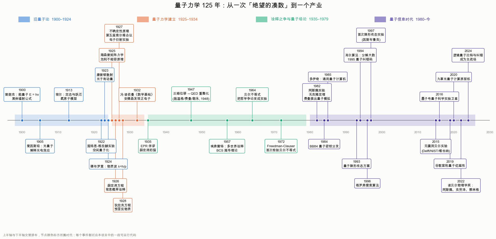
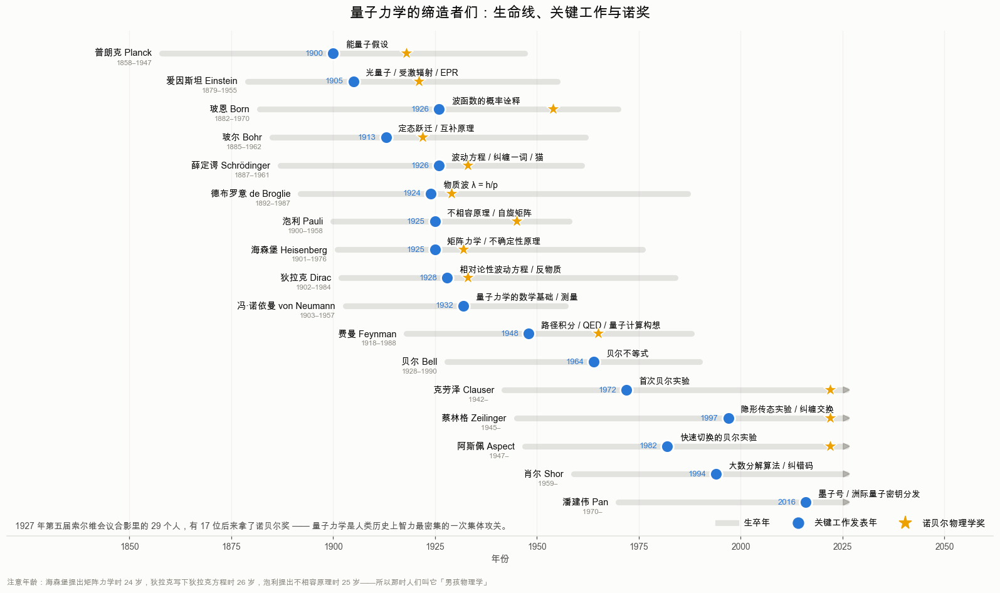

---

# 第一部分：发展史

## 一、旧量子论（1900–1924）：被逼出来的假设

### 普朗克与「绝望的行为」

1900 年，经典物理面对黑体辐射谱束手无策。基于能量均分定理的**瑞利-金斯定律**

$$B_\lambda(\lambda,T)=\frac{2ckT}{\lambda^4}$$

在短波方向发散——后人称之为**紫外灾变**。普朗克为了凑出与实验吻合的曲线，
被迫假设腔壁振子的能量只能取分立值 $E=nh\nu$，得到

$$B_\lambda(\lambda,T)=\frac{2hc^2}{\lambda^5}\cdot\frac{1}{e^{hc/\lambda k_BT}-1}$$

他自己称这是"一次绝望的行为"（an act of despair），并花了十几年想把 $h$ 消掉，没成功。

**本项目做了什么**：把普朗克公式当成一个 PyTorch 可微模型，用带 3% 噪声的合成光谱，
对 $\log h$、$\log k_B$ 做 Adam 优化。从偏离真值 60%/150% 的初值出发，收敛到

* $h = 6.6237\times10^{-34}\ \mathrm{J\cdot s}$（误差 **0.04%**）
* $k_B = 1.3795\times10^{-23}\ \mathrm{J/K}$（误差 **0.08%**）

这正是普朗克 1900 年干的事：他由黑体谱第一次给出了 $h$ 和玻尔兹曼常数，
精度在当时超过了所有其他方法。

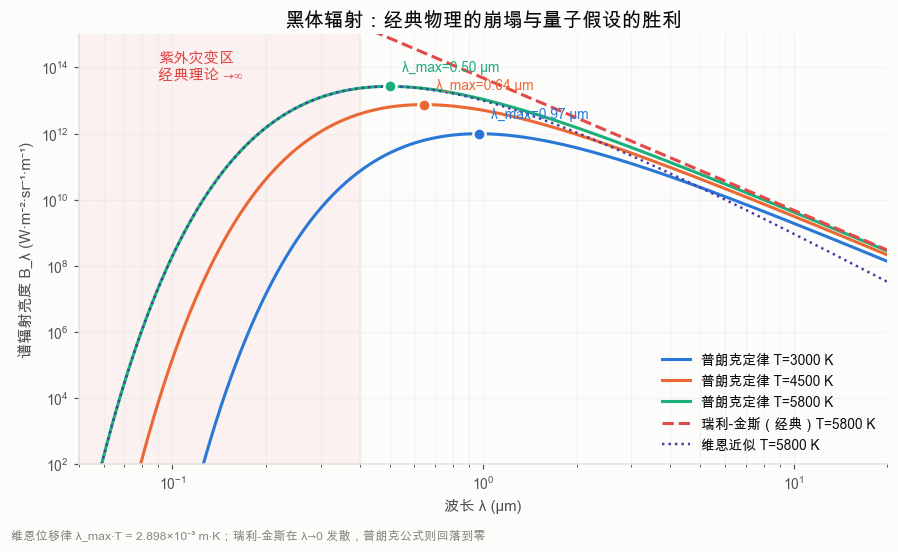
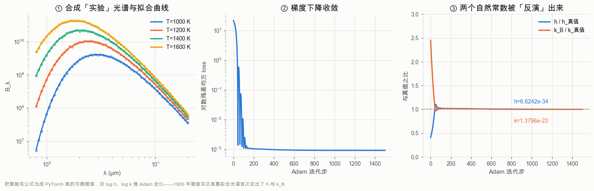

关键物理在第三张图里：经典理论给每个模式分配 $k_BT$（模式无穷多 → 能量无穷），
而量子假设让 $h\nu \gg k_BT$ 的高频模式根本激发不起来。

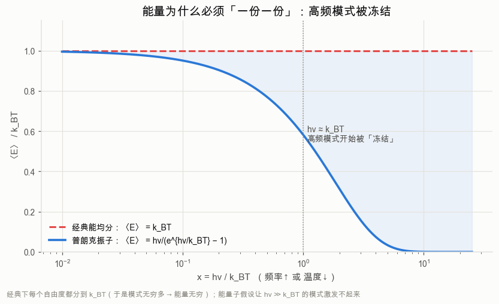

### 爱因斯坦：光真的是粒子

1905 年"奇迹年"，爱因斯坦把普朗克的数学技巧当真：光本身就由光量子组成。

$$E_{\rm kin,max}=h\nu-W \quad\Longrightarrow\quad U_s=\frac{h}{e}\nu-\frac{W}{e}$$

预言极强：遏止电压对频率是直线，**斜率 $h/e$ 与金属种类无关**，且存在截止频率。
密立根本来想证伪它，1916 年反而用它精确测出了 $h$。
本项目对三种金属（Na / Zn / Pt）的模拟数据做共享斜率回归，得到 $h=6.644\times10^{-34}$（误差 0.27%）。

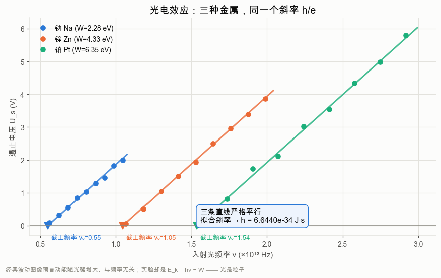

### 玻尔与德布罗意：拼图的两块

玻尔 1913 年假设电子只能待在角动量量子化的定态上，跃迁时才发光：

$$E_n=-\frac{13.606\ \mathrm{eV}}{n^2},\qquad h\nu=E_{n_i}-E_{n_f}$$

一举算出了 1885 年巴尔末凭经验凑出的公式。代码算出的巴尔末线：
656.1 nm（Hα 红）、486.0 nm（Hβ 青）、433.9 nm、410.1 nm——与实验值逐条吻合。

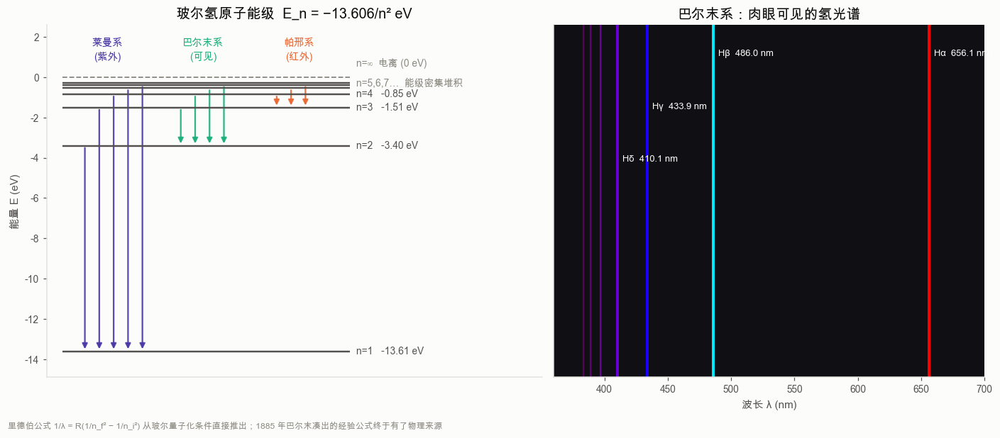

1924 年德布罗意在博士论文里问：既然光波是粒子，物质粒子是不是也是波？
$\lambda=h/p$ 代入 $2\pi r=n\lambda$，玻尔那个凭空来的量子化条件立刻变成了**驻波条件**。

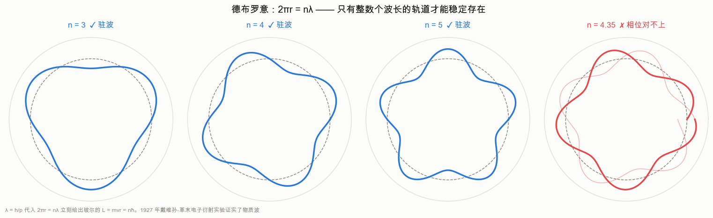

---

## 二、量子力学的建立（1925–1932）：两条路通向同一座山

### 海森堡：不要谈论看不见的东西

1925 年夏天，24 岁的海森堡在赫尔戈兰岛养花粉症，决定只谈可观测量（谱线频率与强度）。
结果物理量变成了不对易的矩阵。玻恩认出那是矩阵乘法，与约当一起写下了整个理论的核心：

$$[\hat x,\hat p]=\hat x\hat p-\hat p\hat x=i\hbar$$

两年后他得到了**不确定性原理**：

$$\sigma_x\sigma_p\ge\frac{\hbar}{2},\qquad
\text{更一般地}\quad \sigma_A\sigma_B\ge\tfrac12\left|\langle[\hat A,\hat B]\rangle\right|$$

必须强调：这不是"仪器不够好"，而是 $x$ 与 $p$ 的本征基互为傅里叶变换，
一个窄，另一个必然宽。代码里直接用产生/湮灭算符造出矩阵验证 $[\hat x,\hat p]=i\hbar$，
并数值检验了三件事：Fock 态给出 $\sigma_x\sigma_p=(n+\frac12)\hbar$，
高斯波包恒为 $0.5000\pm2\times10^{-9}$（最小不确定态），自由波包随时间必然扩散。

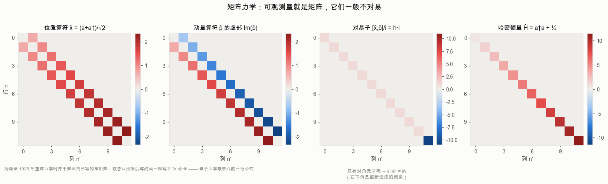
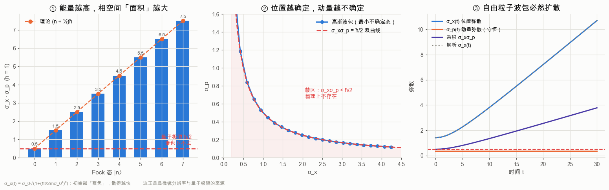

### 薛定谔与玻恩：波函数和它的含义

1926 年初，薛定谔在阿罗萨度假时写下了另一条路：

$$i\hbar\frac{\partial\psi}{\partial t}=\hat H\psi,\qquad
\hat H=-\frac{\hbar^2}{2m}\nabla^2+V(\mathbf r)$$

同年他证明了波动力学与矩阵力学等价。真正的哲学炸弹来自玻恩：$|\psi(x)|^2$ 是**概率密度**。
薛定谔一辈子拒绝接受这个解释（"我不喜欢它，我后悔跟它有关系"），
但它才是量子力学的地基。

代码把 $\hat H$ 离散成矩阵后，"解薛定谔方程"就是一次 `torch.linalg.eigh`：
谐振子前 6 个能级与 $(n+\frac12)\hbar\omega$ 的最大误差是 $2.5\times10^{-4}$。

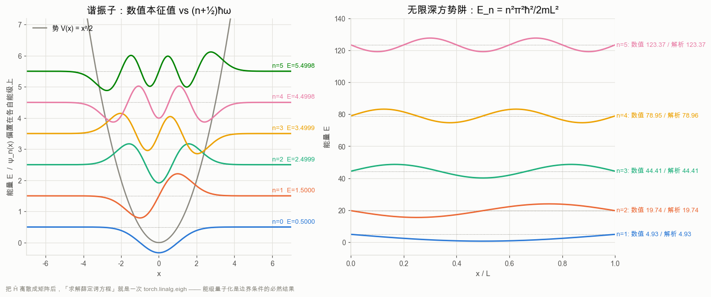

**量子隧穿**用 split-step 傅里叶法（`torch.fft`，复数张量）演化：能量 $E<V_0$ 的波包
依然有一部分穿过势垒，数值透射率与解析公式在 $0.2\le E\le4$ 全程逐点吻合。
$T\approx e^{-2\kappa a}$ 这一条指数律，就是 α 衰变、恒星里的氢聚变、
扫描隧道显微镜和闪存的共同物理基础。

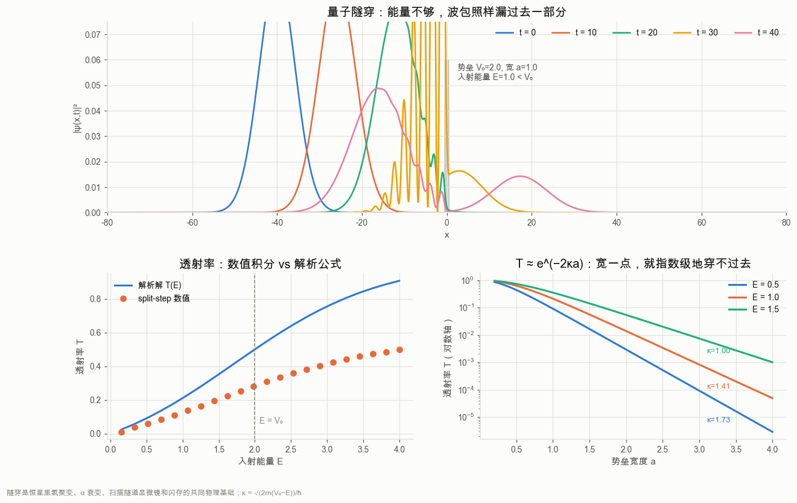

**玻恩规则最直观的样子**是双缝：单个电子随机落点，几万个电子累积出干涉条纹。
关键在于先叠加振幅再取模方（$|\psi_1+\psi_2|^2$），而不是先取模方再相加——
这一步之差就是量子与经典的全部分界。

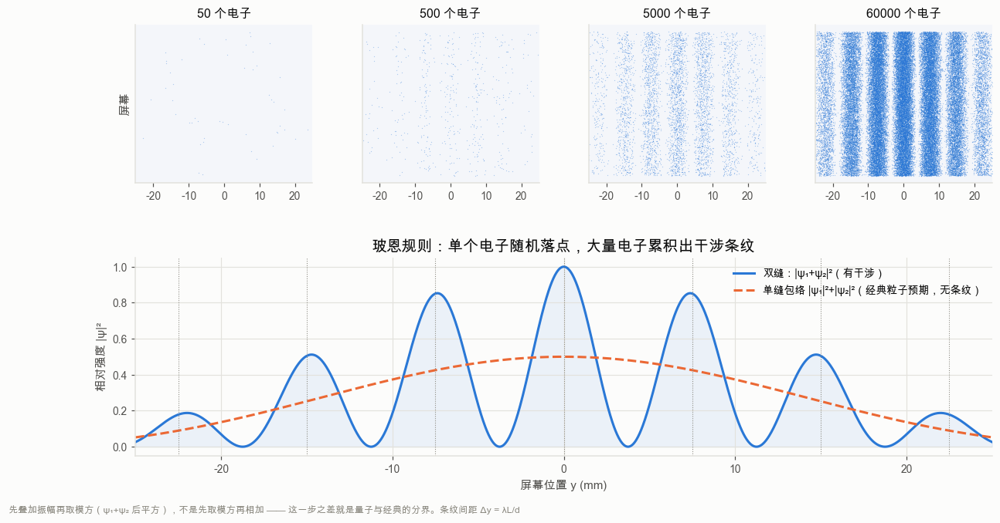

### 狄拉克：我的方程比我聪明

1928 年狄拉克要一个对时空都是一阶、满足洛伦兹协变的方程：

$$(i\hbar\gamma^\mu\partial_\mu-mc)\psi=0,\qquad
\{\gamma^\mu,\gamma^\nu\}=2\eta^{\mu\nu}I_4$$

代价是 $\psi$ 必须是四分量旋量。它一次性白送了三样东西：
电子自旋 $\tfrac12$ 与 $g=2$、氢原子的精细结构、以及负能解。
狄拉克 1931 年断言负能解对应"反电子"，1932 年安德森就在云室里找到了正电子。

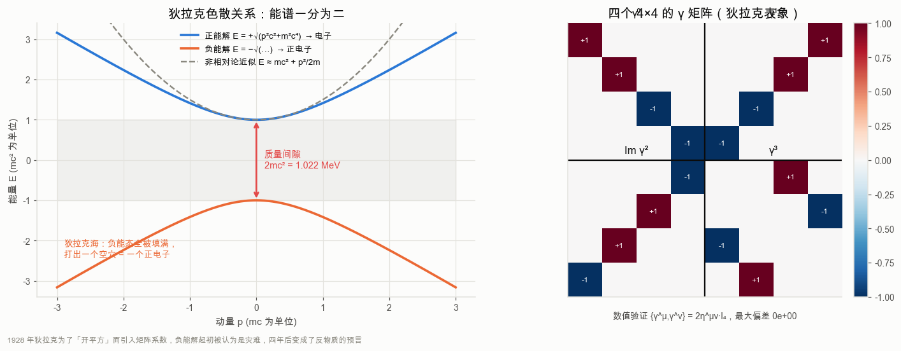

代码严格演化了 1+1 维狄拉克方程（动量空间里 $U(k,t)=\cos Et\,I-i\frac{\sin Et}{E}H(k)$）。
正能解与负能解的干涉让 $\langle x\rangle$ 抖动——**Zitterbewegung 颤动**，
数值主频 2.09 对上理论 $2E(k_0)/\hbar=2.15$，幅度约 $0.2\,\hbar/mc\approx8\times10^{-14}$ m。
薛定谔 1930 年发现它，2010 年离子阱模拟实验第一次"看见"了它。

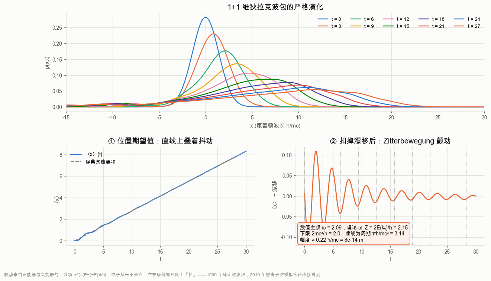

狄拉克方程给出的 $g=2$ 后来成了整个物理学中最精确的预言。加上量子电动力学的
辐射修正（施温格 1948 年的 $\alpha/2\pi$ 是第一项）：

$$\frac{g}{2}\Big|_{\rm QED}=1.001\,159\,652\,181\,61,\qquad
\frac{g}{2}\Big|_{\rm exp}=1.001\,159\,652\,180\,59$$

一致到小数点后第 12 位。

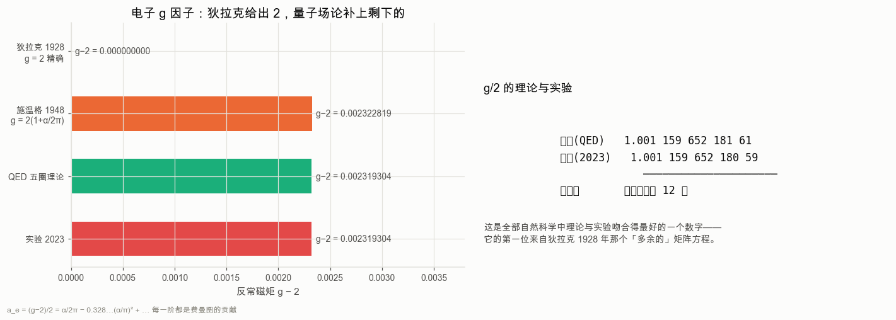

### 索尔维会议与哥本哈根诠释

1927 年第五届索尔维会议是这段历史的高潮：爱因斯坦不断构造思想实验想击倒不确定性原理，
玻尔逐一化解。爱因斯坦那句"上帝不掷骰子"和玻尔的"别再告诉上帝该怎么做"就出自这一时期。
1932 年冯·诺依曼写出《量子力学的数学基础》，把理论装进希尔伯特空间的公理体系，
也把"测量问题"第一次精确地提了出来。

---

## 三、诠释之争变成实验（1935–1982）

1935 年 EPR 论文问：如果测 A 能立刻确定 B 的性质，B 的性质不是早就"实在"地存在吗？
爱因斯坦把这叫"幽灵般的超距作用"，主张量子力学不完备。同年薛定谔造出
"纠缠（Verschränkung）"这个词，并说：**"纠缠不是量子力学的一个特征，而是它的那个特征。"**

争论停在哲学层面近 30 年，直到 1964 年贝尔证明：这件事可以做实验。详见第二部分。

---

## 四、量子信息时代（1980–今）

* 1980–82 贝尼奥夫、费曼提出用量子系统做计算；同年 Wootters-Zurek 证明**无克隆定理**
* 1984 Bennett-Brassard 的 **BB84** 协议：安全性来自物理定律而非计算复杂度
* 1985 多伊奇给出通用量子计算机模型
* 1994 **肖尔算法**（大数分解）、1996 **格罗弗算法**（无结构搜索）
* 1993 隐形传态方案，1997 因斯布鲁克首次实验实现
* 2015 三组无漏洞贝尔实验（Delft / NIST / 维也纳）关上最后的漏洞
* 2016 中国「墨子号」卫星，2017 完成 1200 km 纠缠分发与洲际量子密钥分发
* 2019 谷歌宣称量子优越性，2020 中国「九章」光量子原型机
* 2022 诺贝尔物理学奖授予阿斯佩、克劳泽、蔡林格
* 2023– 纠错与逻辑量子比特成为主战场

---

# 第二部分：四个核心概念

## 1. 量子纠缠：整体确定，部分完全随机

纠缠态就是**无法写成 $|a\rangle\otimes|b\rangle$ 的态**。最简单的例子是贝尔态：

$$|\Phi^+\rangle=\frac{|00\rangle+|11\rangle}{\sqrt2}$$

它的怪异之处可以精确地量化。对整体求熵得 0（纯态，信息完备），
但对任何一方求偏迹后得到 $\rho_A=I/2$，熵为 1 ebit（完全随机）：

$$S(\rho_A)=-\mathrm{Tr}\,\rho_A\log_2\rho_A=1$$

**信息既不在 A 里，也不在 B 里，而在两者的关联中**——这是纠缠最准确的一句话描述。

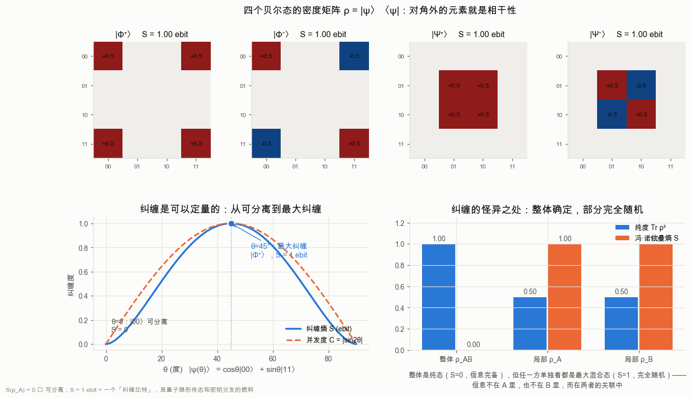

### 贝尔不等式：把哲学变成实验

任何"定域实在论"（局域隐变量）模型都必须满足 CHSH 不等式：

$$S=\left|E(a,b)-E(a,b')+E(a',b)+E(a',b')\right|\le 2$$

而量子力学给出 $E(a,b)=\cos(a-b)$，最大值是**西雷尔森上界** $2\sqrt2\approx2.828$。
本项目的数值结果：

| 量 | 结果 |
|---|---|
| CHSH 扫描最大值 | $S=2.8284$（$=2\sqrt2$） |
| 10 万次抽样"实验" | $S=2.8236\pm0.0045$，超出经典上界 **184σ** |
| 局域隐变量模型（共享随机方向）| $S=2.000$，永远碰不到 2 以上 |
| Alice 边缘概率随 Bob 角度的变化 | $0.00\times10^{0}$（严格无信号） |

最后一行很重要：纠缠**不能**用来超光速通信。Bob 怎么转仪器，Alice 那边的统计分布纹丝不动；
关联只有在两人通过经典信道（$\le c$）比对结果之后才显现出来。

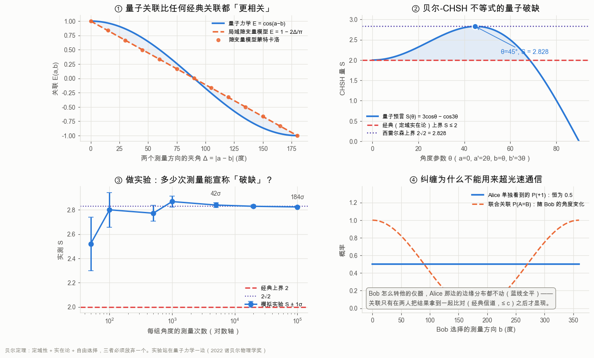

贝尔定理真正的结论是：**定域性、实在论、自由选择，三者必须放弃一个。**
实验站在量子力学一边（2022 年诺贝尔物理学奖）。

## 2. 量子涌现：More is Different

安德森 1972 年的名篇指出：把基本定律知道得再清楚，也推不出超导、磁性、超流。
$N$ 个粒子的希尔伯特空间维数是 $2^N$，里面装着单粒子身上根本不存在的结构。

用**横场 Ising 模型**作最小样板：

$$\hat H=-J\sum_i Z_iZ_{i+1}-g\sum_i X_i$$

* $g/J\to0$：铁磁序，$Z_2$ 对称性自发破缺
* $g/J\to\infty$：顺磁无序
* $g/J=1$：**量子临界点**——能隙闭合、关联长度发散

代码用稀疏 Lanczos（`scipy.sparse.linalg.eigsh`）算 $N\le16$ 的基态，得到：
序参量在 $g<J$ 一侧出现，能隙随链长在 $g=1$ 处压低（$N=12$ 时已降到 0.25），
纠缠熵只在临界点随链长持续增长。

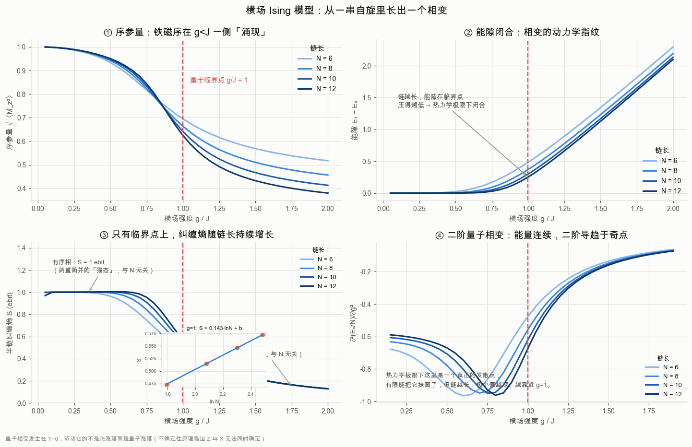

最漂亮的一点是临界点上的纠缠熵服从共形场论的对数标度律：

$$S(l)=\frac{c}{6}\ln\!\left[\frac{2L}{\pi}\sin\frac{\pi l}{L}\right]+\text{const}$$

拟合得到中心荷 $c\approx0.57$（$L=16$），随 $L$ 增大缓慢趋向伊辛普适类的理论值 $c=1/2$。
**微观细节（晶格常数、耦合的具体形式）全被洗掉，只剩下普适的临界行为——这就是涌现。**
一串离散的自旋，在临界点上表现得像一个连续的相对论性场论。

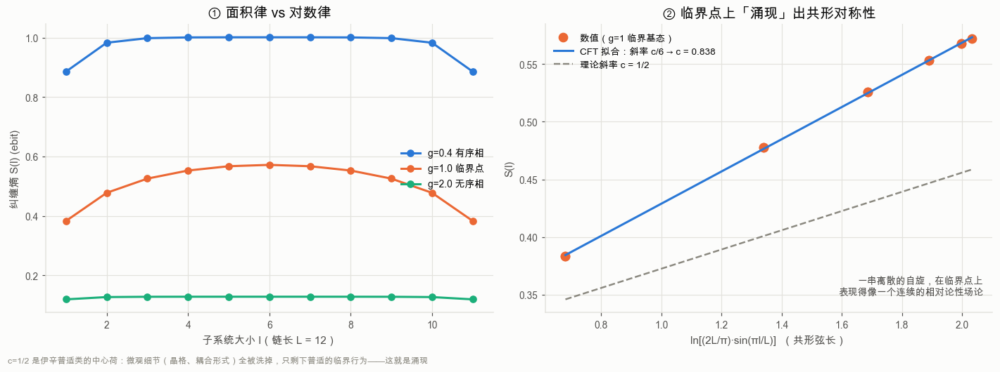

### 经典世界本身也是涌现出来的

第二种涌现是**退相干**（楚雷克）。系统与环境纠缠后，对系统取偏迹，
密度矩阵的非对角元按 $|\rho_{01}(t)|=\prod_k|\cos(2g_kt)|$ 衰减：

* 对角元（各结果的概率）一点没变
* 消失的只是非对角的相干项——干涉能力没了

于是"又死又活"退化成"非死即活，只是我们还不知道"。环境自由度越多衰减越快；
一只真实的猫有 $\sim10^{25}$ 个自由度，退相干时间在 $10^{-20}$ 秒量级。
这解释了经典世界为何浮现，但**不**解决"为什么只出现一个结果"的测量问题——
那仍是哥本哈根、多世界、GRW 等诠释在争的东西。

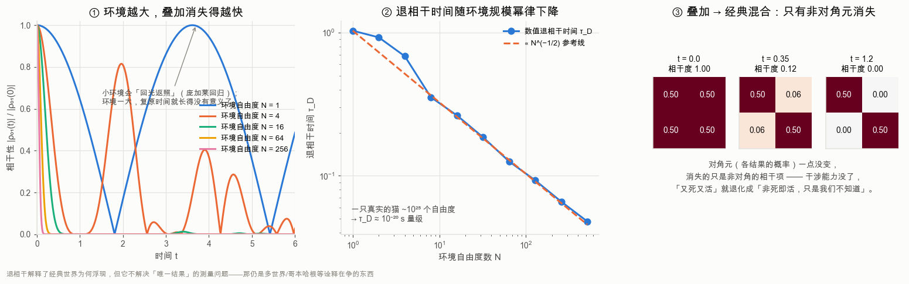

## 3. 量子计算：用干涉把答案挤出来

费曼 1982：*"自然不是经典的。见鬼，如果你想模拟自然，最好把计算机做成量子的。"*
$N$ 个量子比特的态要 $2^N$ 个复数才写得下——50 个量子比特就是 16 PB 内存。

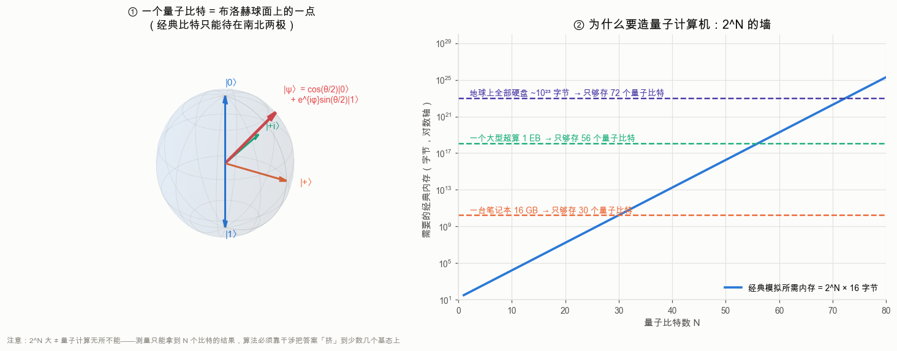

但 $2^N$ 大 ≠ 无所不能：测量只能拿到 $N$ 个比特的结果，
算法必须靠**干涉**把答案挤到少数几个基态上。项目里实现了四个经典例子（全部用自写的
PyTorch 态矢量模拟器 `qhv/qlib.py`）：

| 算法 | 结果 | 经典对照 |
|---|---|---|
| Deutsch-Jozsa（$n=4$）| 常数函数 $P(\lvert0000\rangle)=1.000$；平衡函数 $=2\times10^{-35}$ | 最坏要 $2^{n-1}+1=9$ 次查询，量子 1 次 |
| 格罗弗搜索（$N=1024$）| 25 次迭代后命中概率 **0.9995** | 经典期望 512 次 |
| QFT 找周期（肖尔核心）| $2^x \bmod 21$ 的周期 $r=6$，进而 $21=3\times7$ | 大数分解的指数加速 |
| VQE（$N=6$ TFIM，$g=J$）| 5 层 ansatz 收敛到 $E=-7.29301$，精确值 $-7.29623$，误差 **0.044%** | — |

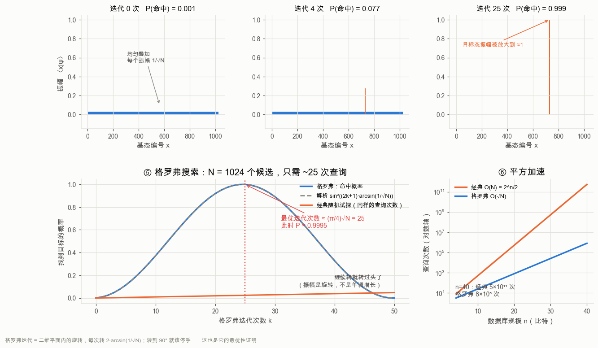
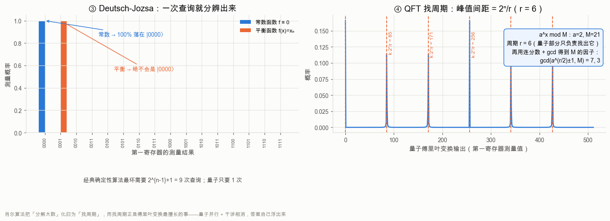

**VQE 是 PyTorch 在这个项目里最本色的用法**：把参数化量子电路当成一个可微模型，
用 autograd 求 $\partial E/\partial\theta$，Adam 更新参数，变分原理保证 $E(\theta)\ge E_0$。
真机上则用参数移位规则 $\partial E/\partial\theta=[E(\theta+\frac\pi2)-E(\theta-\frac\pi2)]/2$，
两次测量给出一个精确梯度——这正是量子机器学习的基础。


## 4. 量子通信：窃听必然留下痕迹

**无克隆定理**（Wootters-Zurek 1982）：不存在复制任意未知量子态的幺正操作。
坏消息是不能中继放大，好消息是窃听必然被发现。

### 隐形传态（1993）

1 份纠缠 + 2 比特经典信息 = 把一个未知量子态搬到远处。代码对 400 个随机态
× 4 种贝尔测量结果做了检验：**最小保真度 = 1.000000000000**。
四种测量结果各占 25%，Alice 的结果本身完全随机——没有那 2 比特经典信息，
Bob 手里就是最大混合态。所以"传送"必须等经典信息到达，不违反相对论；
而原件在测量中被销毁，与无克隆定理自洽。

反过来是**超密编码**：1 个量子比特 + 1 份纠缠可以送 2 比特经典信息，
代码里的解码矩阵是严格的单位阵。


### BB84 量子密钥分发（1984）

Eve 做截取-重发时，有 1/2 概率选错基，选错时 Bob 又有 1/2 概率读错，
于是筛选后误码率 $\mathrm{QBER}=\eta/4$，全拦截即 **25%**。模拟结果：

| 场景 | QBER |
|---|---|
| 无窃听 | $0.0000\pm0.0000$ |
| Eve 全程截取-重发 | $0.2491\pm0.0089$（理论 0.25）|

安全密钥率 $r=1-2h(e)$（Shor-Preskill），误码率超过 **11%** 就归零、协议中止。
**BB84 的安全性不依赖"敌人算力不够"这种假设，量子计算机再强也破不了。**

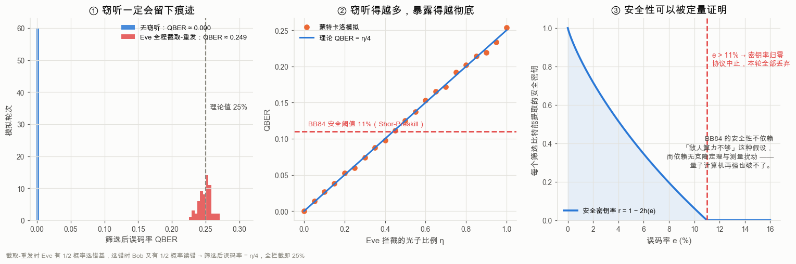

---

# 第三部分：代码结构

```
quantum-history-viz/
├── run_all.py              # 一键跑完 10 章，输出 27 张图
├── requirements.txt
├── figures/                # 全部输出
└── qhv/
    ├── qlib.py             # 用 PyTorch 从零写的量子模拟库
    ├── style.py            # 中文字体 + 通过 CVD 校验的配色
    ├── s01_planck.py  …  s10_timeline.py
```

`qhv/qlib.py` 是全项目的地基，约 200 行：

* 态矢量用形状 `(2,)*n` 的 `complex128` 张量表示，第 $k$ 个轴 = 第 $k$ 个量子比特；
  **施加量子门 = 对某几个轴做张量收缩**，因此天然可微（VQE 就靠这一点）
* 单/双比特门（H, X, Y, Z, S, T, Rx/Ry/Rz, CNOT, CZ, SWAP）
* 偏迹、冯·诺依曼熵、纯度、保真度、布洛赫矢量
* 多体算符与横场 Ising 哈密顿量

数值方法一览：

| 方法 | 用在哪 | 实现 |
|---|---|---|
| 自动微分 + Adam | 反演 $h$、$k_B$；VQE | `torch.autograd` |
| 有限差分 + 稠密对角化 | 定态薛定谔方程 | `torch.linalg.eigh` |
| split-step 傅里叶 | 波包演化、隧穿、狄拉克方程 | `torch.fft` |
| 稀疏 Lanczos | 多体基态（$N\le16$） | `scipy.sparse.linalg.eigsh` |
| SVD → 施密特分解 | 纠缠熵 | `torch.linalg.svdvals` |
| 蒙特卡洛抽样 | 双缝、CHSH 实验、BB84 | `torch.multinomial` / `torch.rand` |

---

## 参考

* M. Planck, *Zur Theorie des Gesetzes der Energieverteilung im Normalspectrum* (1900)
* A. Einstein, *Über einen die Erzeugung und Verwandlung des Lichtes betreffenden heuristischen Gesichtspunkt* (1905)
* P. A. M. Dirac, *The Quantum Theory of the Electron*, Proc. R. Soc. A **117**, 610 (1928)
* A. Einstein, B. Podolsky, N. Rosen, Phys. Rev. **47**, 777 (1935)
* J. S. Bell, *On the Einstein Podolsky Rosen Paradox*, Physics **1**, 195 (1964)
* P. W. Anderson, *More Is Different*, Science **177**, 393 (1972)
* W. H. Zurek, *Decoherence, einselection, and the quantum origins of the classical*, RMP **75**, 715 (2003)
* R. P. Feynman, *Simulating Physics with Computers*, IJTP **21**, 467 (1982)
* P. Calabrese, J. Cardy, *Entanglement entropy and quantum field theory*, JSTAT (2004)
* C. H. Bennett, G. Brassard, *Quantum cryptography: Public key distribution and coin tossing* (1984)
* X. Fan et al., *Measurement of the Electron Magnetic Moment*, PRL **130**, 071801 (2023)
